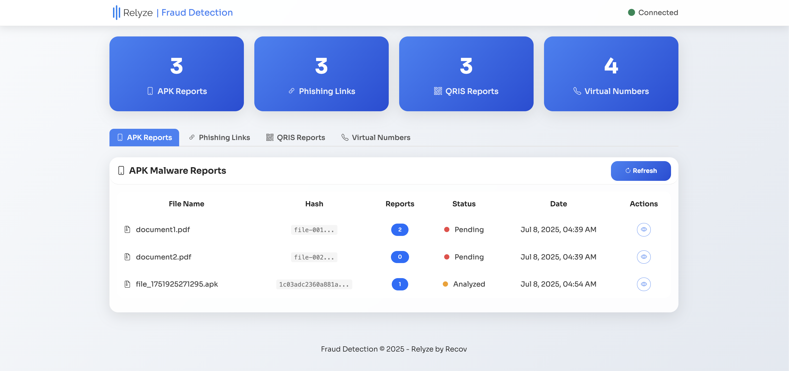

# 🛡️ Fraud Detection System

<p align="center">
  
</p>

A comprehensive fraud detection platform that utilizes AI-powered analysis and WhatsApp bot integration to scan for phishing links, APK malware, QRIS fraud, and virtual phone number scams—all in real-time.

---

## 🚀 Features

### 🔍 Multi-Modal Threat Detection

- 🕵️‍♂️ **Phishing URL Analysis**
- 📱 **APK Malware Analysis**
- 💸 **QRIS Payment Scanner**
- 📞 **Virtual Number & E-wallet Check**

### 🤖 AI-Powered Insights

- ⚙️ DeepSeek LLM-based threat classification
- 📄 Auto-generated forensic reports
- 📲 WhatsApp-optimized result formatting

### 💬 WhatsApp Integration

- 💬 `/phising <url>`, `/telp <number>` commands
- 📁 Automatic APK & QR image parsing
- ⚠️ Instant fraud alerts

### 🧭 Modern Web Dashboard



- 📊 Real-time data
- 🖥️ Responsive & beautiful UI (glassmorphism + Sora font)
- 🔍 Detailed modals for in-depth investigation

---

## 🛠️ Tech Stack

| Layer       | Technology                           |
| ----------- | ------------------------------------ |
| Backend     | Node.js, Express.js, Sequelize ORM   |
| Frontend    | HTML5, CSS3, Bootstrap 5, JavaScript |
| Database    | MySQL                                |
| AI Engine   | DeepSeek (OpenAI-compatible)         |
| Messaging   | whatsapp-web.js                      |
| APK Tools   | APKTool, DEX Analyzer                |
| QRIS Parser | QRIS data decoder                    |

---

## ⚙️ Installation

### 1️⃣ Clone & Setup

```bash
git clone https://github.com/wmasday/fraud
cd fraud
npm install
```

### 2️⃣ Environment Config

Create a `.env` file:

```env
DB_HOST=localhost
DB_USER=your_user
DB_PASSWORD=your_password
DB_NAME=fraud_detection
DEEPSEEK_API_KEY=your_key
QPANEL_API_KEY=your_key
PORT=3000
```

### 3️⃣ Database Init

```bash
npx sequelize-cli db:migrate
npx sequelize-cli db:seed:all # Optional
```

### 4️⃣ Start Server

```bash
npm run dev   # Dev mode
npm start     # Prod mode
```

---

## 📱 WhatsApp Bot Commands

| Command          | Description                                   |
| ---------------- | --------------------------------------------- |
| `/phising <url>` | Analyze suspected phishing URL                |
| `/telp <number>` | Check phone number e-wallet & WhatsApp status |

📸 Example:

```
/phising http://fake-bank.com/login
/telp 081234567890
```

---

## 🖥️ Web Dashboard

📍 Visit: `http://localhost:3000`

- 🔄 Live update interface
- 📁 Access to all reports (Phishing, APK, QRIS, Virtual Numbers)
- 🔍 Modal view for detail inspection

---

## 🧩 Database Schema

Tables include:

- **Applications**
- **Phishing**
- **QRIS**
- **Virtual Numbers**

Each table stores: `report_count`, `llm_report`, timestamps, and specific metadata.

---

## 🧠 Deep Analysis Modules

### APK Analysis

- 🔐 Dangerous permission flags
- 🕳️ Obfuscation detection
- 🌐 Suspicious network activity
- 📊 Malware risk score

### Phishing Detection

- 🌐 Domain similarity
- 🔗 URL pattern flags
- 🔒 SSL certificate inspection
- 🧬 HTML structure validation

### QRIS Inspection

- 🧾 Payload verification
- 🏪 Merchant details
- 🚨 Fraud signature match

### Virtual Number Check

- 📶 Carrier info
- 💼 E-wallet integration (GoPay, OVO, etc.)
- 📱 WhatsApp status
- 🧠 Risk classifier

---

## 🎨 UI Design System

| Element        | Design Focus             |
| -------------- | ------------------------ |
| Theme          | Light, professional      |
| Typography     | Sora Font                |
| Components     | Cards, Tables, Modals    |
| Effects        | Glassmorphism, Hover FX  |
| Responsiveness | Desktop + Mobile support |

---

## 🔐 Security Measures

- ✅ .env + credentials protection
- ✅ XSS / SQLi prevention
- ✅ Uploaded file handling
- ✅ Secure sessions & API limits

---

## 📦 Deployment

### 🔁 Production Setup

- Configure `.env`
- Secure DB & SSL
- Use **PM2** for process management
- Use **Nginx** as reverse proxy

### 🐳 Dockerized Setup

```bash
docker build -t fraud-detection .
docker run -p 3000:3000 fraud-detection
```

---

## 📡 API Endpoints

| Endpoint               | Description              |
| ---------------------- | ------------------------ |
| `/api/applications`    | Get all APK analyses     |
| `/api/phisings`        | Get all phishing reports |
| `/api/qris`            | Get all QRIS scans       |
| `/api/virtual_numbers` | Get all number reports   |

---

## 🤝 Contributing

1. Fork this repo
2. Create a new branch: `git checkout -b feature/your-feature`
3. Commit: `git commit -m "Add new feature"`
4. Push: `git push origin feature/your-feature`
5. Submit a PR 🚀

---

## 📝 License

This project is licensed under the MIT License. See `LICENSE`.

---

## 🆘 Support

📩 Contact dev team or create an issue for help.

---

## 🔄 Changelog

### v1.0.0

- ✅ Initial release
- ✅ WhatsApp integration
- ✅ AI threat detection
- ✅ Web dashboard

---

> ⚠️ **Disclaimer**: This tool is intended for educational and ethical security research only. Always ensure proper authorization before running any analysis.
